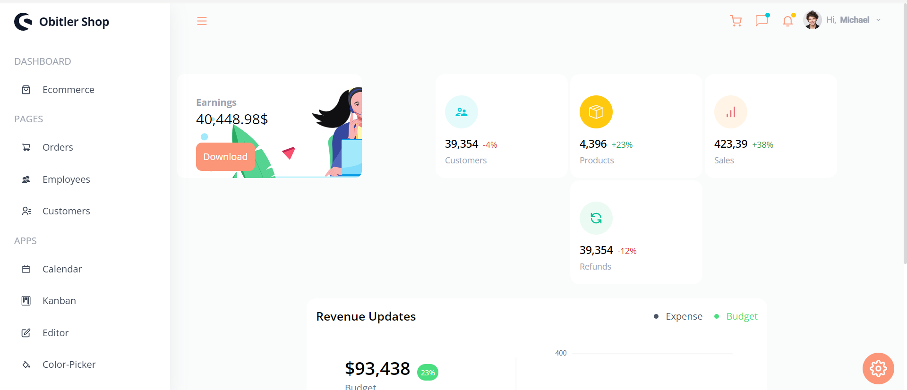
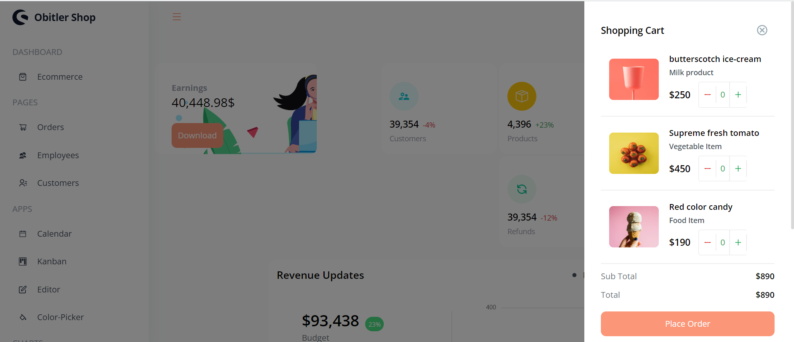
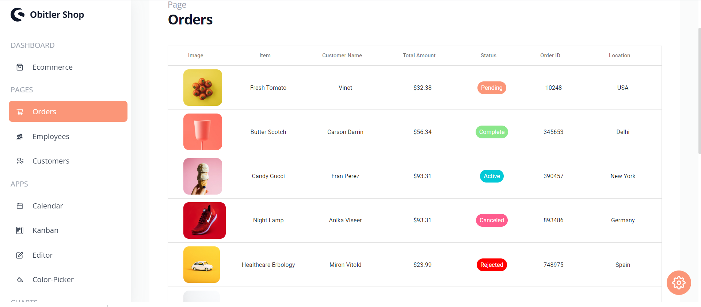

# Build and Deploy a React Admin Dashboard App With Theming, Tables, Charts, Calendar, Kanban and More

## Introduction
This is a code repository for the corresponding video tutorial.

## Stay up to date with new projects
New major projects coming soon, subscribe to the mailing list to stay up to date https://resource.jsmasterypro.com/newsletter